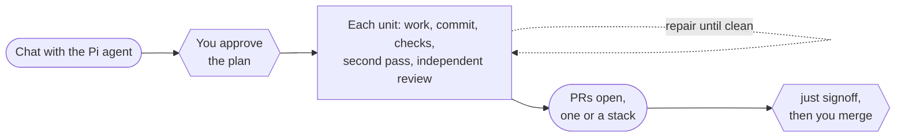

# Pi Journey

A Pi extension for work that takes several stops. Chat with your Pi agent as usual. When the plan is settled, start a journey: one coordinator carries it through owned workers, checks, and reviews, publishes PRs, and stops with a named reason whenever something needs you. A journey never merges.

## The implement journey

`/journey implement` turns a plan from your conversation, or from an issue, into reviewed PRs. Think of it as an assembly line you start and finish. You decide twice, when you approve the plan and when you authorize the merge. In between, each unit is written, committed, checked, and read by two reviewers, one of them independent, and any station can send it back to repair or stop the line with a reason.



Read [the implement journey](docs/implement-journey.md) for the full walkthrough: who acts at each step, the two reviews, every gate, stacked PRs, and what happens when a journey stops. [plan.html](plan.html) holds the design and acceptance contract, and [the implementation guide](docs/journeys-guides/implementation-v1-1.md) is the manual process the journey recreates.

## Try it

Requirements are Linux or macOS, Node 24+, pnpm, Pi 0.99.1, Git, an authenticated GitHub CLI, a Pi model from a built-in or `models.json` provider, and a logged-in Codex CLI.

```sh
pnpm install --frozen-lockfile
cd /path/to/your/repository
pi -e /path/to/pi-journey/src/index.ts
```

This loads the extension alongside your other extensions and changes no installed Pi settings. Use a disposable project for your first model-backed run.

## Commands

Type `/journey` to open the picker, or name the mode directly. Tab completes the names.

| Command | Behavior |
| --- | --- |
| `/journey implement` | Draft a plan from the conversation, then open the approval dialog |
| `/journey implement <note or issue>` | Draft the plan from that source, such as `#42` |
| `/journey implement <digest>` | Open the approval dialog for a plan already recorded in this branch |
| `/journey implement <digest> --allow-checks` | Approve that plan without a dialog, for RPC and scripts |
| `/journey ping` | Placeholder mode: the Pi agent answers ping |
| `/journey status` | Show the phase, the plan digest, and any blocker |
| `/journey stop` | Stop drafting, or cancel owned work and release the repository |
| `/journey resume [--accept-edits]` | Continue an unfinished run; optionally accept recovered edits |
| `/journey retire` | Retire an unfinished run, keeping its files, branches, PRs, and history |

## Configuration

Put overrides in the target repository's `.pi/journey.json`. Approval snapshots them into the run, and unknown keys are rejected.

```json
{
  "baseBranch": "main",
  "secondPassSkill": "/absolute/path/to/2nd-pass/SKILL.md",
  "impactsSkill": "/absolute/path/to/blast-radius/SKILL.md",
  "retrospectiveSkill": "/absolute/path/to/pa-retro/SKILL.md",
  "reviewerModel": "gpt-6.1-sol",
  "reviewerEffort": "xhigh",
  "maxRepairRounds": 3
}
```

The skills default to `~/.codex/skills/`. See [ConfigSchema](src/contracts.ts) for every key and its bounds.

## Safety

Workers edit only approved paths through scoped file tools and have no shell, Git, or GitHub access. External edits are preserved, never overwritten. Approving checks trusts the code they run. The journal stays in the checkout's Git directory at `pi-journey/`, one process lease owns a checkout, and recovery reconciles Git and GitHub before it retries anything. The extension never resets, deletes data, force-pushes, or merges.

## Develop

Run `just install` once per clone to install dependencies and the lefthook hooks: gitleaks and Biome before each commit, and `just check` before each push. `just check` runs strict TypeScript, the behavioral tests, Biome, the build, an isolated Pi load, and the tests of the ship scripts. GitHub Actions runs it only when started by hand with `gh workflow run ci.yml --ref <branch>`.

A PR merges into `main` only with a green `signoff` status on its head. Push, then run `just signoff`. `just merge` signs off the PR head and merges exactly that commit. It pins the head but not the destination or `main`, so leave the PR and `main` untouched while it runs; [#15](https://github.com/pascalandy/pi-journey/issues/15) tracks closing that window. Both scripts come from pascalandy-blog-paper and need `uv`, `gitleaks`, and the `gh signoff` extension.
