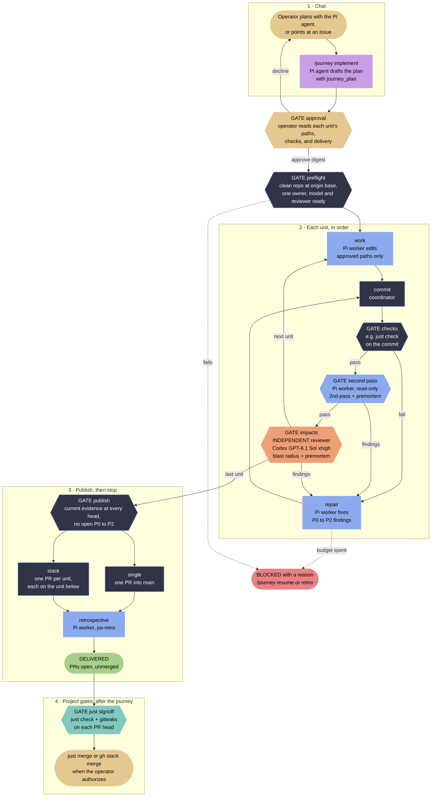
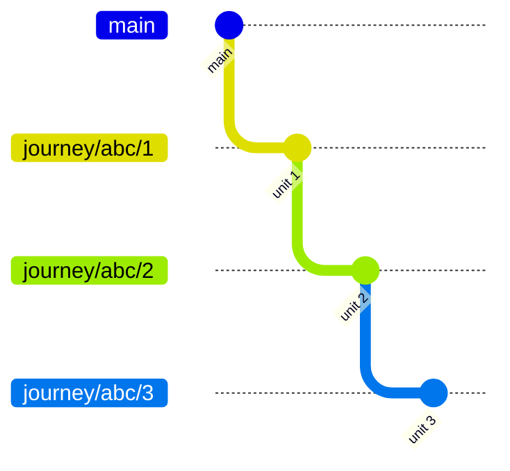

# The implement journey

You planned a change with the Pi agent, or wrote it down in an issue. `/journey implement` turns that plan into reviewed PRs. The journey coordinator drives every step, and it stops with a named reason whenever something needs you. It never merges. Merging stays a separate gate that you authorize.

This page explains the use case at a high level. [plan.html](../plan.html) holds the design and acceptance contract, and [the implementation guide](journeys-guides/implementation-v1-1.md) is the manual process this journey recreates.

## The mental model

Think of a journey as a small assembly line that you start and you finish.

- **You decide twice.** Once when you approve the plan, and once when you authorize the merge. Nothing in between asks you for permission, and nothing in between can merge.
- **Units move down the line one at a time.** Each unit passes the same stations. A worker writes it, the coordinator commits it, the checks test it, and two reviewers read it. Any station can send the unit back to repair, and repairs are budgeted.
- **Two reviewers look from different sides.** The second pass is an insider: the same Pi setup that wrote the code, checking it against the plan. The impacts review is an outsider: Codex, a different agent and model, asking what would break a week after merging.
- **The line either stops or finishes.** When a gate fails for a reason repair cannot fix, the run stops as blocked, names the reason, and waits for you. When every unit passes, it publishes PRs and ends. It never skips a failed gate.
- **The product is PRs, not a merge.** Landing them is the project's gate: `just signoff`, then your merge.

## Who acts

| Actor | Role | Authority |
| --- | --- | --- |
| Operator (you) | Plans in chat, approves the plan, authorizes merges | The only one who can start a run or merge |
| Pi agent | Drafts the plan from the conversation or an issue | Records a plan; approves nothing |
| Journey coordinator | Runs the stages, commits, checks, pushes, opens PRs | Owns Git and GitHub effects; never merges |
| Pi worker | Edits the unit's files, runs the second pass and the retrospective | Scoped file tools only; no shell, Git, or GitHub |
| Codex reviewer | Independent impacts review of each unit | Read-only sandbox |
| Project gates | `just signoff` and `just merge` in the target repository | Run after the journey, with your authorization |

## The journey at a glance

Read the diagram from top to bottom. Colors name the actor, and each hexagon is a gate that can loop back or stop the run.

Legend. Yellow is the operator, mauve the Pi agent, dark blue the journey coordinator, light blue a Pi worker, peach the independent Codex reviewer, and teal a project gate. Red means blocked; green means delivered.

## Step by step

1. **Chat and draft.** Plan as usual. When the plan is settled, run `/journey implement`, or `/journey implement #42` to start from an issue. The Pi agent calls `journey_plan` with the goal, the plan, ordered units with the exact paths each may write and a commit message, the project's check command, and the delivery shape. That tool is available only while drafting.
2. **Approve.** The approval dialog opens when the Pi agent finishes. It lists every unit's writable paths and commit message, each check and its declared effects, and the delivery. Declining starts nothing and keeps drafting open for a revision. Approval binds to the plan's digest, so a changed plan or a tree navigation revokes it.
3. **Preflight.** The coordinator takes an exclusive lease on the checkout. It requires a clean repository root at the current `origin` base, and it confirms the GitHub identity, the skills, the Codex reviewer, and that a worker session can load the selected model.
4. **Each unit, in order.**
   - A Pi worker edits only the unit's approved paths.
   - The coordinator commits the attributable edits.
   - The checks run on the committed tree, for example `just check`, and must leave it unchanged.
   - A read-only Pi worker runs the second pass with the 2nd-pass skill and writes its own premortem.
   - The independent Codex reviewer runs the impacts review with the blast-radius skill and a premortem.
   - A failed check or an open P0 to P2 finding sends the unit to repair, then back through commit, checks, and both reviews. After `maxRepairRounds`, the run blocks.
5. **Publish.** Once every unit passes, the coordinator pushes the branches and opens the PRs. It publishes only when every head has current evidence and no P0 to P2 finding is open. A PR counts only while it is open on the recorded base and head.
6. **Retrospective.** A read-only Pi worker follows the pa-retro skill and keeps its result in the journal. The run ends as delivered, with the PRs open and unmerged.
7. **After the journey.** The project's own gates take over. `just signoff` runs `just check` and gitleaks on each PR head and posts a green `signoff` status, which GitHub requires before a merge into `main`. `just merge`, or `gh stack merge` for a stack, lands the PRs only when you authorize it.

## Two reviews, and why both

The second pass comes from the same Pi setup that wrote the code. It catches mistakes against the plan and writes a premortem, but it shares the writer's blind spots.

The impacts review is independent. A different agent, Codex on GPT-6.1 Sol at xhigh by default, reads the unit's diff in a read-only sandbox. It applies the blast-radius skill and asks what would break a week after merging. The coordinator accepts its result only when the runtime header shows the configured model, effort, and read-only sandbox, and only for the exact head it reviewed.

## The gates

| Gate | Decided by | Passes when | On failure |
| --- | --- | --- | --- |
| Approval | Operator | You approve the displayed digest | Nothing starts; drafting stays open |
| Preflight | Coordinator | Clean root at the `origin` base, one owner, tools and model ready | Blocked with the reason |
| Checks | Coordinator | The plan's commands pass on the committed tree and leave it unchanged | Repair |
| Second pass | Pi worker, read-only | No open P0 to P2 finding | Repair |
| Impacts | Codex reviewer, independent | No open P0 to P2 finding at the reviewed head | Repair |
| Repair budget | Coordinator | Fewer than `maxRepairRounds` repairs | Blocked; resume cannot renew the budget |
| Publish | Coordinator | Current evidence at every head, PRs open on their recorded base and head | Blocked with the reason |
| Signoff | Project, `just signoff` | `just check` and gitleaks pass on the pushed head | No green status; GitHub refuses the merge |
| Merge | Operator | You authorize `just merge` or `gh stack merge` | The PRs stay open |

## One PR or a stack

Choose `single` delivery for one cumulative PR into `main`. Choose `stack` when the units build on each other and a reviewer should see one layer at a time. Each unit then gets its own branch on top of the unit below, and its own PR.

The bottom PR targets `main`. PR 2 targets `journey/<id>/1`, and PR 3 targets `journey/<id>/2`. Each layer carries its own checks and reviews. To land a stack, sign off each layer, then run `gh stack merge`.

## When a journey stops

- **Blocked.** A gate failed. `/journey status` shows the reason. Fix the cause, then run `/journey resume`, or `/journey retire` to keep the work and start a fresh plan.
- **Stopped.** `/journey stop` cancels owned work, waits for it to drain, and releases the checkout. Navigating the conversation tree, forking, or switching sessions does the same, and is cancelled when the work cannot drain.
- **Crashed or reloaded.** Nothing restarts on its own. The run comes back blocked. `/journey resume` reconciles Git and GitHub before it continues, and `--accept-edits` accepts recovered edits that match the recorded paths and hashes.

While a stage runs, the Pi agent keeps only read tools and `!` shell commands are refused. The session is yours again whenever no stage runs.

## Not in the journey yet

The implementation guide goes further than the journey does today. These steps are tracked as issues: the polish review ([#8](https://github.com/pascalandy/pi-journey/issues/8)), a confidence report and merge gate ([#9](https://github.com/pascalandy/pi-journey/issues/9)), resuming with your answers ([#10](https://github.com/pascalandy/pi-journey/issues/10)), and publishing retrospective issues ([#11](https://github.com/pascalandy/pi-journey/issues/11)).
